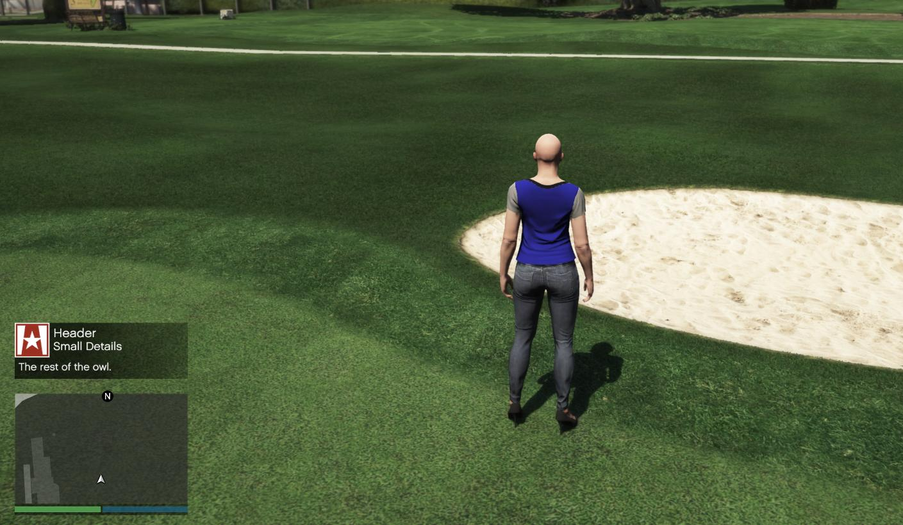

# Spielerbenachrichtigung

Die Spielerbenachrichtigung ist eine Nachrichtenbox die links über der Minimap dargestellt wird.

Die Position an der diese Nachricht angezeigt wird ist nicht veränderbar.

Sie ist nur clientseitig benutzbar, da sie das aufrufen einer Nativen Funktion benötigt, kann aber durch ein Event serverseitig angesprochen werden.

Schau dir das Beispiel unten an, um zu sehen wie es funktionieren kann!



**Clientseitig**

```js
alt.onServer('drawNotification', drawNotification);

export function drawNotification(imageName, headerMsg, detailsMsg, message) {
    native.beginTextCommandThefeedPost('STRING');
    native.addTextComponentSubstringPlayerName(message);
    native.endTextCommandThefeedPostMessagetextTu(
        imageName.toUpperCase(),
        imageName.toUpperCase(),
        false,
        4,
        headerMsg,
        detailsMsg,
        1.0,
        ''
    );
    native.endTextCommandThefeedPostTicker(false, false);
}
```

## Beispiel

**Serverseitig**

```js
alt.emitClient(player, 'drawNotification', 'CHAR_AMMUNATION', 'Header', 'Small Details', 'The rest of the owl.');
```

**Clientseitig**

```js
drawNotification('CHAR_AMMUNATION', 'Header', 'Small Details', 'The rest of the owl.');
```
