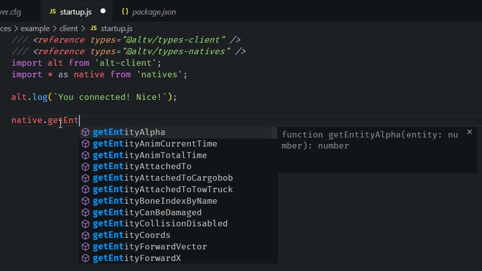

# Installation der Serverdateien

## Voraussetzungen

Für die Programmierung und Bereitstellung eines alt:V Servers benötigst du folgende Dinge.

-   [NodeJS 13+](https://nodejs.org/en/download/current/)
-   [Visual Studio Code](https://code.visualstudio.com/download)
-   [GIT](https://git-scm.com/downloads)
-   [alt:V Client](https://altv.mp/#/downloads)

## Allgemeine Richtigstellungen

Die hier veröffentlichten Hilfestellungen erwarten, dass auf Windows programmiert und gearbeitet wird.

-   Du solltest wissen wie man mit der Eingabeaufforderung (CMD) oder Powershell umgeht.
-   Du solltest wissen wie man eine .exe Datei in der Eingabeaufforderung (CMD) oder Powershell ausführt.
-   Du solltest ein gutes Basiswissen in JavaScript haben.

**Wichtig**

Alle Codeblöcke mit dem Prefix `$` sind dafür gemacht in der Eingabeaufforderung (CMD) oder Powershell ausgeführt zu werden.

**Tue dies nicht!** Mitkopieren des `$` Prefix während des kopierens von Befehlen.

## Installieren des altv-pkg von Stuyk

[altv-pkg](https://github.com/stuyk/altv-pkg) ist ein Hilfepaket, welches dir schnell und sicher alle benötigten Dateien von alt:V für Windows oder Linux bereitstellt. Dieses Paket enthält außerdem eine Beispielresource mit der du starten kannst.

Du kannst es über die Eingabeaufforderung oder Powershell installieren.

```sh
$ npm install -g altv-pkg
```

Solltest du Probleme haben das npm Paket Global zu installieren, solltest du die **Powershell** mit **Administrationsrechten** und folgendem Befehl ausführen.

```sh
$ Set-ExecutionPolicy -Scope CurrentUser -ExecutionPolicy Unrestricted -Force;
```

Überprüfe, ob alles richtig installiert wurde. Mit folgendem Versioncheck.

```sh
$ altv-pkg --version
```

## Benutzen des altv-pkg

Nach der Installation laden wir die Serverdateien von alt:V herunter.

Erstelle einen Ordner für deinen Server. Gehe mit der Eingabeaufforderung oder Powershell in das von dir erstellte Verzeichnis.

```sh
$ altv-pkg d release
```

Dieser Befehl wird dazu führen, dass du danach gefragt wirst, welchen Spielmodus du erstellen möchtest.

Standardmäßig werden die Serverdateien und Resourcedateien automatisch in deinem aktuellen Verzeichnis erstellt.

Folge den Instruktionen.

-   Drücke **N**, wenn du das Voice (Sprachkommunikation) installieren willst
-   Drücke **Y**, für eine Beispielresource


## Verstehen der heruntergeladenen Dateien

Es ist wichtig über ein paar Dateien und die Generelle Ordnerstruktur nach dem herunterladen zu sprechen. Hier sind ein paar Dateien aufgelistet die vorhanden sein sollten nachdem `altv-pkg d release` ausgeführt wurde.

```
|   altv-server.exe
|   libnode.dll
|   package-lock.json
|   package.json
|   server.cfg
|   update.json
|
+---data
|       vehmodels.bin
|       vehmods.bin
|
+---modules
|       js-module.dll
|
\node_modules
\---resources
    \---example
        |   resource.cfg
        |
        +---client
        |       startup.js
        |
        \---server
                startup.js
```

### altv-server.exe

Mit dieser ausführbaren Datei kannst du den Server starten. Über die Eingabeaufforderung (CMD) oder Powershell ist diese ebenfalls ausführbar.

```
$ altv-server.exe
```

Benutze die Tastenkombination `Ctrl + C`, um den Server zu stoppen.

### package.json

Hier werden die `node_modules` definiert die du benutzt. In diesen Ordner werden alle Pakete von NPM isntalliert, die du installierst. Sei dir bewusst, dass du clientseitig ohne einen Bundler keine npm-packages aus dem `node_modules` Verzeichnis benutzen kannst.

```json
{
    "name": "altv-pkgserver",
    "version": "0.0.0",
    "description": "Don't worry we made this package.json for you.",
    "main": "index.js",
    "scripts": {
        "update": "altv-pkg d release"
    },
    "author": "stuyk",
    "type": "module",
    "prettier": {
        "printWidth": 120,
        "tabWidth": 4,
        "singleQuote": true,
        "bracketSpacing": true
    },
    "devDependencies": {
        "@altv/types-client": "^1.1.1",
        "@altv/types-natives": "^1.1.0",
        "@altv/types-server": "^1.4.2",
        "@altv/types-webview": "^1.0.2"
    }
}
```

Wichtige Informationen, die du aus obiger Struktur mitnehmen kannst sind:

-   Wir benutzen die [Prettier Erweiterung für VSCode](https://marketplace.visualstudio.com/items?itemName=esbenp.prettier-vscode)
-   Wir benutzen `"type": "module"`, um den [ES6 Syntax](https://www.w3schools.com/js/js_es6.asp) nutzen zu können.
-   Der Server wird aktualisiert, indem `$ npm run update` aus dem Hauptverzeichnis ausgeführt wird.

Dies ist der allgemeine Aufbau der package.json und funktioniert hier genauso wie in einem normalen NodeJS-Projekt.

### server.cfg

Aus dieser Konfigurationsdatei liest der Server aus, mit welchen Parametern er starten soll.

```sh
name: "TestServer",
host: "0.0.0.0",
port: 7788,
players: 1024,
#password: "verysecurepassword",
announce: false,
#token: no-token,
gamemode: "Freeroam",
website: "test.com",
language: "en",
description: "test",
debug: false,
modules: [
  "js-module",
],
resources: [
    "example"
],
tags: [
  "customTag1",
  "customTag2",
  "customTag3",
  "customTag4"
]
```

#### password

Password ist ein optionaler Parameter. Auskommentiert wird mit `#`.

#### token

Token ist ein optionaler Parameter. Auskommentiert wird mit `#`. Den Token erhälst du nachdem du eine Nachricht an den alt:V Discord Bot gesendet hast.

#### debug

Während der Entwicklung eines Servers ist zu empfehlen diesen Parameter auf `true` zu setzen. Dies erlaubt dir, dich mit einem Server neuzuverbinden nachdem der Server neugestartet wurde. Mehr Informationen auf [Client Konfiguration](https://wiki.altv.mp/Altv.cfg).

#### resources

Hier listest du alle Ordner auf, welche sich innerhalb des `/resources` Ordners befinden. Alle Resourcen benötigen eine `resource.cfg` innerhalb ihres Ordners, um durch den Server geladen werden zu können.

Dies ist die `resource.cfg` Datei aus dem `/resources/example` Ordner.

```sh
type: js,
main: server/startup.js,
client-main: client/startup.js,
client-files: [
	client/*
],
deps: []
```

Der Haupteinstiegspunkt ist die `example` resource in `/resources/example/server/startup.js`

Dasselbe gilt für die clientseitigen Dateien mit dem Unterschied, dass überall `client` anstatt `server` in den Pfaden stehen muss.

### /data

Dieser Ordner beinhaltet binäre Dateien, die uns definieren welche Fahrzeugnamen mit welchen Werten zusammengehören. Zum Beispiel enthalten diese Dateien, welche Tuningmöglichkeiten ein Fahrzeug hat. Diese werden nach heruntergeladen automatisch benutzt.

### /modules

Hier werden spezielle `.dll` oder `.so` Dateien für die verschiedensten Module, welche die Programmiersprachen verfügbar machen, abgelegt. Zum Beispiel JS, C#, Lua, etc. Diese Module sind normalerweise von Leuten erstellt, welche für alt:V entwickeln. Diese sind oft ein Produkt der Community.

### /node_modules

In diesen Ordner werden packages durch NPM installiert. Hier ist ein Beispiel, welches die Stanford Javascript Crypto Library von NPM installiert.

```sh
$ npm i sjcl
```

### /resources

`resources` ist der Ordner an dem du Resourcen erstellt, welche durch die `server.cfg` geladen werden können. Solltest du ein größeres Projekt planen, empfehle ich nur eine einzige Resource für den Code zu haben. Der Umgang damit ist einfacher und hat Performanzvorteile.

## Öffnen deines Arbeitsbereiches

Öffne in VS:Code deinen Ordner in dem du deinen alt:V Server installiert hast.

Dies sollte so aussehen wie auf dem folgendem Foto:


In `resources/example/startup.js` kannst du starten deinen Code zu schreiben.

Stelle sicher, dass die `server.cfg` die Resource namens `example` in der `resources` Sektion stehen hat.

```sh
resources: [
  "example"
],
```

Starte deinen Server in einer Eingabeaufforderung (CMD) oder Powershell, um zu überprüfen, ob dieser richtig gestartet ist.


## Zum Server verbinden

Mit dem Server verbinden kannst du, in dem du den alt:V Client startest, auf Direkt verbinden drückst und folgende IP eingibst.

```
127.0.0.1:7788
```

## Serverseitig

Serverseitiger Code sollte im `server` Ordner geschrieben werden.

Du musst zusätzlich noch die serverseitigen `types` von alt:V importtieren.

```js
/// <reference types="@altv/types-server" />
import alt from 'alt-server';

alt.log('test');
```

Dein serverseitiger Code sollte nun Autovervollständigung des Syntax unterstützen.


## Clientseitig

Clientseitiger Code sollte im `client` Ordner geschrieben werden.

Dies ist der einzige Bereich, in dem eine `native` benutzbar ist.

Du musst zusätzlich noch die clientseitigen `types` von alt:V importtieren.

```js
/// <reference types="@altv/types-client" />
/// <reference types="@altv/types-natives" />
import alt from 'alt-client';
import * as native from 'natives';

alt.log(`You connected! Nice!`);
```

Dein clientseitiger Code sollte nun Autovervollständigung des Syntax unterstützen.


