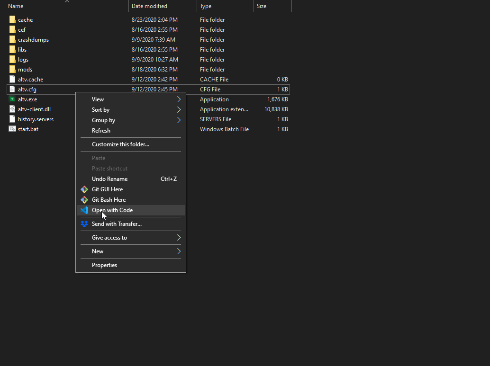

# Setup Client Debugging

You should have the alt:V client setup at this stage.

Go to the folder location of where your altv.exe is located and find the altv.cfg.



## altv.cfg

Make sure that this parameter is set to true.

If it does not exist. Create the parameter.

```sh
debug: 'true'
```
