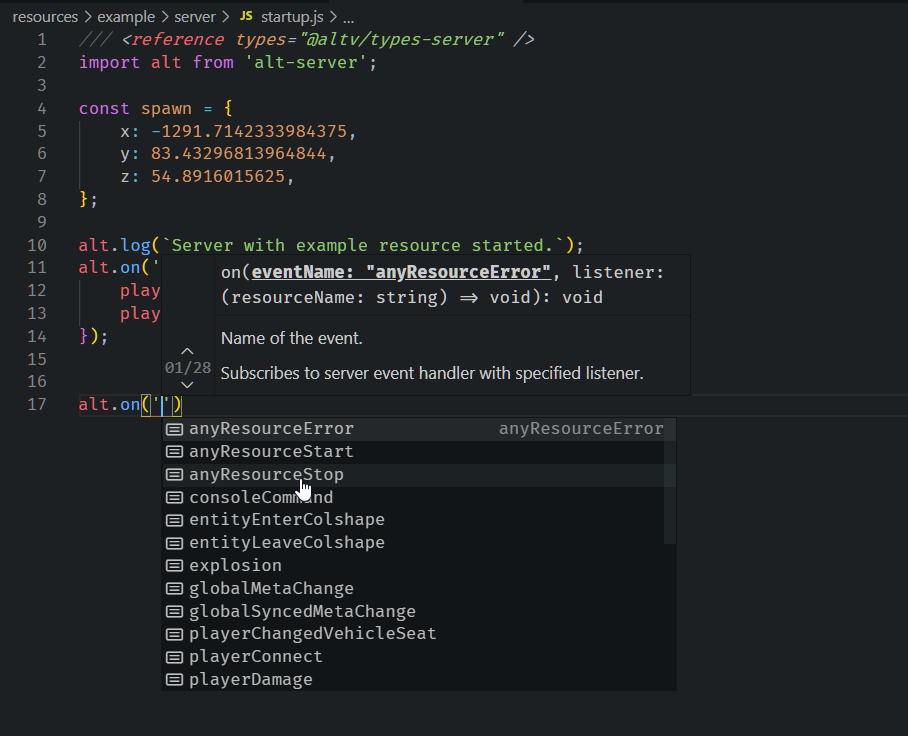

# Instalarea fișierelor

## Condiții Prealabile

Înainte de începe, vă rugăm să instalați următoarele programe și utilități.

-   [NodeJS 13+](https://nodejs.org/en/download/current/)
-   [Visual Studio Code](https://code.visualstudio.com/download)
-   [GIT](https://git-scm.com/downloads)
-   [alt:V Client](https://altv.mp/#/downloads)

## Ipoteze Generale

Acest ghid vă presupune că veți lucra într-un mediu de dezvoltare Windows.

-   Ar trebui să știți cum să utilizați un Command Prompt sau Powershell
-   Ar trebui să știți cum să deschideți Command Prompt sau Powershell
-   Ar trebui să știți că puteți rula fișiere .exe în Command Prompt sau Powershell
-   Ar trebui să știți bazele limbajului JavaScript

**Important**

Toate blocurile de coduri prefixate cu `$` sunt menite să fie rulate in Command Prompt sau PowerShell

**NU** copiați și `$` în sine când copiați comenzi.

## Instalarea altv-pkg

[altv-pkg](https://github.com/stuyk/altv-pkg) este o utilitate care vă va permite rapid să rotiți serverele binare pe Windows sau Linux. Acest lucru vă va oferi, de asemenea, o resursă de bază cu care puteți lucra.

Puteți să-l instalați dintr-un Command Prompt.

```sh
$ npm install -g altv-pkg
```

Dacă întâmpinați probleme la instalarea fisierelor globale. Deschideți **Powershell** cu **Run as Administrator** și rulați următoarea comandă.

```sh
$ Set-ExecutionPolicy -Scope CurrentUser -ExecutionPolicy Unrestricted -Force;
```

Verificați instalarea verificând versiunea.

```sh
$ altv-pkg --version
```

## Folosirea altv-pkg

După instalare, vom descărca fișierele serverului.

Creați un director pentru serverul dumneavoastră. Apoi deschideți un command prompt în directorul respectiv.

```sh
$ altv-pkg d release
```

Acest lucru vă va solicita informații cu privire la modul de joc pe care îl creați.

În mod implicit, fișierele serverului și ale resurselor vor fi generate automat în directorul dvs. curent.

Urmați instrucțiunile de pe ecran.

-   **N** pentru Voce
-   **Y** pentru un Exemplu de Sursa


## Înțelegerea fișierelor descărcate

Este important să explorați câteva dintre fișiere și structura generală creată după descărcarea binarelor serverului. Iată fișierele sau câteva fișiere generale care ar fi trebuit să fie descărcate după executarea comenzii `altv-pkg d release`.

```
|   altv-server.exe
|   libnode.dll
|   package-lock.json
|   package.json
|   server.cfg
|   update.json
|
+---data
|       vehmodels.bin
|       vehmods.bin
|
+---modules
|       js-module.dll
|
\node_modules
\---resources
    \---example
        |   resource.cfg
        |
        +---client
        |       startup.js
        |
        \---server
                startup.js
```

### altv-server.exe

Acesta este principalul fișier binar pentru rularea serverului. Puteți rula acest lucru dintr-un Command Prompt.

```
$ altv-server.exe
```

Folosiți combinația de taste `Ctrl + C` pentru a închide procesul serverului.

### package.json

Aici va fi creat directorul `node_modules` pe care il veți utiliza. Aici instalați pachete care pot fi utilizate de server. Rețineți că nu puteți utiliza `node_modules` in client-side.

```json
{
    "name": "altv-pkgserver",
    "version": "0.0.0",
    "description": "Don't worry we made this package.json for you.",
    "main": "index.js",
    "scripts": {
        "update": "altv-pkg d release"
    },
    "author": "stuyk",
    "type": "module",
    "prettier": {
        "printWidth": 120,
        "tabWidth": 4,
        "singleQuote": true,
        "bracketSpacing": true
    },
    "devDependencies": {
        "@altv/types-client": "^1.1.1",
        "@altv/types-natives": "^1.1.0",
        "@altv/types-server": "^1.4.2",
        "@altv/types-webview": "^1.0.2"
    }
}
```

Puncte importante de luat în calcul de la ceea ce este definit în această structură.

-   Folosim extensia[Prettier extension for VSCode](https://marketplace.visualstudio.com/items?itemName=esbenp.prettier-vscode)
-   Folosim `"type": "module"` pentru a suporta [ES6 Syntax](https://www.w3schools.com/js/js_es6.asp).
-   Ne putem actualiza fișierele serverului rulând `$ npm run update` în directorul principal.

Aceasta este în principal structura `package.json` care funționează în mare parte ca un proiect normal NodeJS.

### server.cfg

Acesta utilizează un analizator personalizat pentru configurația serverului dumneavoastră.

```sh
name: "TestServer",
host: "0.0.0.0",
port: 7788,
players: 1024,
#password: "verysecurepassword",
announce: false,
#token: no-token,
gamemode: "Freeroam",
website: "test.com",
language: "en",
description: "test",
debug: false,
modules: [
  "js-module",
],
resources: [
    "example"
],
tags: [
  "customTag1",
  "customTag2",
  "customTag3",
  "customTag4"
]
```

#### password

Password este un parametru opțional. Comentat cu `#`.

#### token

Token este un parametru opțional. Comentat cu `#`. Puteți obține un token de pe discord-ul alt:V prin trimiterea unuia dintre boții din lista de membri.

#### debug

Este recomandat să fie setat pe `true` pentru a lucra cu serverul în modul de dezvoltare. Acest lucru va permite reconectarea la server dacă adăugați `debug` în [configurația clientului](https://wiki.altv.mp/Altv.cfg), de asemenea.

#### resources

Aici listați folderele din folderul `/resources` pe care doriți să le utilizați. Toate resursele trebuie să aibă un `resource.cfg` în folder-ul respectiv pentru a putea fi încărcate ca resursă.

Iată `resource.cfg` din folderul `/resources/example`.

```sh
type: js,
main: server/startup.js,
client-main: client/startup.js,
client-files: [
	client/*
],
deps: []
```

Punctul principal de intrare pentru server-side din resursa `example` este `/resources/example/server/startup.js`.

La fel și pentru client-side, cu excepția faptului că folosește `client` în loc de `server`.

### /data

În acest folder avem fișiere de dare care ne ajută să definim ce nume de vehicule corespund cu ce valori. Acestea ar trebui descărcate și utilizate în mod automat.

### /modules

Aici încărcați fișierele speciale `.dll` sau `.so` pentru modulele care utilizează diferite limbaje de programare. Adică C#, Lua, etc. Acestea sunt de obicei generate de dezvoltatorii alt:V . Realizate de comunitate.

### /node_modules

Aici sunt instalate pachetele pe care le descărcați din NPM. Iată un exemplu despre instalarea bibliotecii Stanford Javascript Crypto Library din NPM.

```sh
$ npm i sjcl
```

### /resources

Resources este locul în care creați resurse noi care pot fi încărcate în `server.cfg`. Este foarte recomandat ca, dacă creați un proiect foarte mare, să rămâneți la o singură resursă din motive de performanță și ușurință în utilizare.

## Deschiderea spațiului de lucru

Deschideți folderul în care ați configurat serverul alt:V în VS:Code.

Ar trebui să arate ca imaginea de mai jos.


Puteți începe să scrieți propriul cod în `resources/example/startup.js`.

Asigurați-vă că `server.cfg` are `example` în secțiunea de `resources` din `server.cfg`.

```sh
resources: [
  "example"
],
```

Rulați serverul din Command Prompt pentru a vă asigura că totul s-a încărcat corect.


## Conectarea

Vă puteți conecta deschizând client-ul alt:V și utilizând conectarea directă.

```
127.0.0.1:7788
```

## Server-Side

Codul care trebuie să fie rulat în server-side trebuie scris în folderul `server`.

De asemenea, trebuie să importați `types` pentru alt:V Server Side.

```js
/// <reference types="@altv/types-server" />
import alt from 'alt-server';

alt.log('test');
```

Partea de server-side ar trebui să aibă acum completare automată.



## Client-Side

Codul care trebuie să fie rulat în client-side trebuie scris în folderul `client`.

Aceasta este singura secțiune în care puteți utiliza în mod activ un `native`.

De asemenea, trebuie să importați `types` pentru alt:V Client Side.

```js
/// <reference types="@altv/types-client" />
/// <reference types="@altv/types-natives" />
import alt from 'alt-client';
import * as native from 'natives';

alt.log(`You connected! Nice!`);
```

Partea de client-side ar trebui să aibă acum completare automată.


