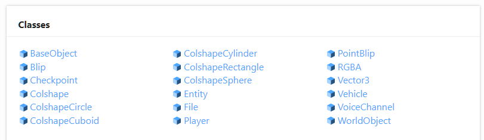

# Úvod do API

API je miesto, kde môžete získať väčšinu informácií o funkčnosti a písaní kódu pre alt: V.

Jedinou výhradou je, že existuje niekoľko príkladov použitia väčšiny funkcií.

-   [https://altmp.github.io/altv-typings/](https://altmp.github.io/altv-typings/)

## Navigácia v rozhraní API

Keď čítate API, existujú dve sekcie. **(Kliknite na odkaz vyššie)**

-   alt-server
- Odkaz na všetky funkcie dostupné na strane servera.
- alt-client

     - S odvolaním sa na všetky funkcie dostupné na strane klienta.

     - Často sa používa funkcia *natives/game*.

     - Ovplyvňuje iba klient hráča.

## Čítanie API

Keď sa pozeráte na API, všetky parametre a ich typy sú definované pre funkcie a triedy.

Tu je príklad pohľadu na funkciu `alt.on`.

```ts
on(eventName: "playerConnect", listener: (player: Player) => void): void
```

Čítanie tohto môže byť na začiatku trochu mätúce, ak neviete, ako čítať API.

-   Názov *event-u* sa nazýva `on`
- Prvý parameter je `playerConnect`
- Druhým parametrom je *listener* alebo *callback* funkcia. Prepúšťa typ `alt.Player`.
     - Kliknutím na `Player` si môžete pozrieť, aké vlastnosti ponúka.
     - Niektoré z týchto vlastností sú `name`,` ip` atď.
- `: void` znamená, že sa nič nevráti.

Tu je rovnaká funkcia pri plnom použití.

```js
alt.on('playerConnect', handlePlayerConnect);

function handlePlayerConnect(player) {
    alt.log(`${player.name} sa pripojil na server.`);
}
```

## Používanie API

Spravidla máte niekoľko rôznych typov premenných, funkcií, tried atď. (variables, functions, classes).

Poďme sa rozprávať o tom, čo ktorý z nich znamená a ako vyzerajú v kóde.

### Funkcie (Functions)

Funkcie vždy fungujú ako funkcie a API má pre ne zvyčajne sekciu.


Tu je príklad toho, ako môže vyzerať použitie jednej z vyššie uvedených funkcií.

```js
alt.setTimeout(() => {
    alt.log(`Hello. This triggered after 5 seconds.`);
}, 5000);
```

### Triedy/Klasy (Classes)

Triedy fungujú ako bežné triedy JavaScriptu. Závisí to len od toho, ako importujete `alt-server` alebo `alt-client`.

Predpokladajme, že máte *prefix* `alt` pre všetko.



Pamätajte, že nie všetky triedy/klasy (classes) sú prístupné alebo sa dajú vytvoriť.

Tu je príklad toho, ako môže vyzerať použitie jednej z vyššie uvedených tried/klas (class).

```js
const pos = new alt.Vector3(0, 0, 0);
const vehicle = new alt.Vehicle('infernus', pos.x, pos.y, pos.z, 0, 0, 0);
const shape = new alt.ColshapeCylinder(pos.x, pos.y, pos.z, 5, 10);
```

### Vlastnosti (Properties)

Vlastnosť bude zvyčajne existovať v rámci triedy/klasy (class). Sú prístupné **bez** zátvorkách.

Sú tiež čitateľné, takže ich nemusíte nastavovať vždy.

Tu je príklad použitia automobilu/vozidla (vehicle).

```js
const vehicle = new alt.Vehicle('infernus', 0, 0, 0, 0, 0, 0);

if (vehicle.engineOn === false) {
    vehicle.engineOn = true;
}
```

### Metódy (Methods)

Metóda (method) zvyčajne existuje v triede/klase (class). Sú prístupné so zátvorkami.

```js
const vehicle = new alt.Vehicle('infernus', 0, 0, 0, 0, 0, 0);
const result = vehicle.getDoorState(0);
vehicle.setArmoredWindowHealth(0, 100);
```
