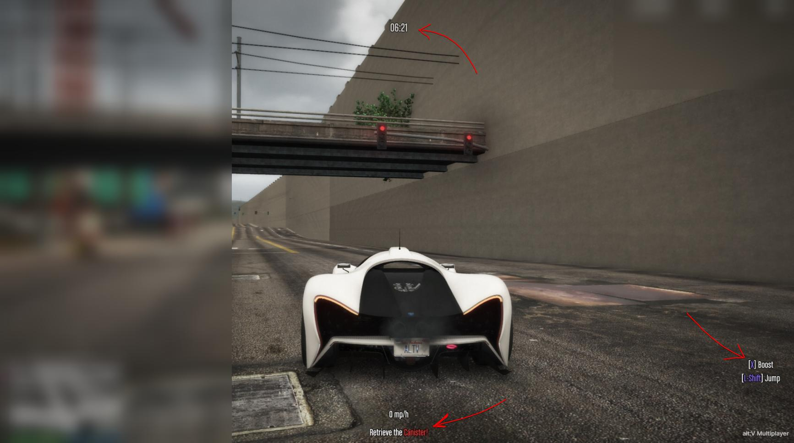

# Kreslenie textu v 3D a 2D

Používa sa na kreslenie textu na obrazovku alebo v 3D priestore. Funguje to iba na **strane klienta**.



**Client Side**

```js
export function drawText2d(
    msg,
    x,
    y,
    scale,
    fontType,
    r,
    g,
    b,
    a,
    useOutline = true,
    useDropShadow = true,
    layer = 0,
    align = 0
) {
    let hex = msg.match('{.*}');
    if (hex) {
        const rgb = hexToRgb(hex[0].replace('{', '').replace('}', ''));
        r = rgb[0];
        g = rgb[1];
        b = rgb[2];
        msg = msg.replace(hex[0], '');
    }

    native.beginTextCommandDisplayText('STRING');
    native.addTextComponentSubstringPlayerName(msg);
    native.setTextFont(fontType);
    native.setTextScale(1, scale);
    native.setTextWrap(0.0, 1.0);
    native.setTextCentre(true);
    native.setTextColour(r, g, b, a);
    native.setTextJustification(align);

    if (useOutline) {
        native.setTextOutline();
    }

    if (useDropShadow) {
        native.setTextDropShadow();
    }

    native.endTextCommandDisplayText(x, y);
}

export function drawText3d(
    msg,
    x,
    y,
    z,
    scale,
    fontType,
    r,
    g,
    b,
    a,
    useOutline = true,
    useDropShadow = true,
    layer = 0
) {
    let hex = msg.match('{.*}');
    if (hex) {
        const rgb = hexToRgb(hex[0].replace('{', '').replace('}', ''));
        r = rgb[0];
        g = rgb[1];
        b = rgb[2];
        msg = msg.replace(hex[0], '');
    }

    native.setDrawOrigin(x, y, z, 0);
    native.beginTextCommandDisplayText('STRING');
    native.addTextComponentSubstringPlayerName(msg);
    native.setTextFont(fontType);
    native.setTextScale(1, scale);
    native.setTextWrap(0.0, 1.0);
    native.setTextCentre(true);
    native.setTextColour(r, g, b, a);

    if (useOutline) {
        native.setTextOutline();
    }

    if (useDropShadow) {
        native.setTextDropShadow();
    }

    native.endTextCommandDisplayText(0, 0);
    native.clearDrawOrigin();
}
```

## Príklad použitia

**Na strane klienta**

```js
alt.everyTick(() => {
    drawText2d('Hello from Top Center of Screen', 0.5, 0.05, 0.4, 4, 255, 255, 255, 255);

    const playerPos = { ...alt.Player.local.pos };
    drawText3d(`This is You`, playerPos.x, playerPos.y, playerPos.z, 0.3, 4, 255, 255, 255, 255);
});
```
