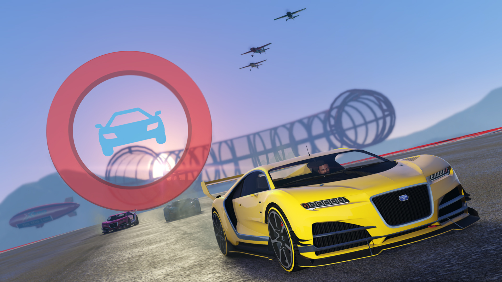

# *Marker-y*

*Marker-y* sú tie mierne priehľadné objekty v 3D svete.



**Na strane klienta**

```js
/**
 * Draw a marker. Requires alt.everyTick or alt.setInterval
 *
 * @param  {number} type
 * @param  {alt.Vector3} pos
 * @param  {alt.Vector3} dir
 * @param  {alt.Vector3} rot
 * @param  {alt.Vector3} scale
 * @param  {number} r
 * @param  {number} g
 * @param  {number} b
 * @param  {number} alpha
 */
export function drawMarker(type, pos, dir, rot, scale, r, g, b, alpha) {
    native.drawMarker(
        type,
        pos.x,
        pos.y,
        pos.z,
        dir.x,
        dir.y,
        dir.z,
        rot.x,
        rot.y,
        rot.z,
        scale.x,
        scale.y,
        scale.z,
        r,
        g,
        b,
        alpha,
        false,
        true,
        2,
        false,
        undefined,
        undefined,
        false
    );
}
```

## Príklad použitia

**Na strane klienta**

```js
alt.everyTick(() => {
    drawMarker(1, new alt.Vector3(25, 2, 1), new alt.Vector3(0, 0, 0), new alt.Vector3(1, 1, 1), 255, 0, 0, 100);
});
```
