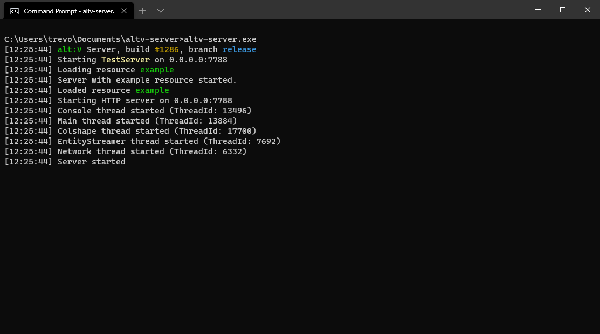

# Inštalácia serverových súborov

## Predom nevyhnutné

Skôr ako začnete, nainštalujte si tieto a pomocné programy.

-   [NodeJS 13+](https://nodejs.org/en/download/current/)
-   [Visual Studio Code](https://code.visualstudio.com/download)
-   [GIT](https://git-scm.com/downloads)
-   [alt:V Klient](https://altv.mp/#/downloads)

## Všeobecné predpoklady

Táto príručka bude predpokladať, že budete pracovať vo vývojovom prostredí Windows.

- Mali by ste vedieť, ako používať príkazový riadok alebo Powershell
- Mali by ste vedieť, ako otvoriť príkazový riadok alebo Powershell
- Mali by ste vedieť, že súbory .exe môžete spúšťať v príkazovom riadku alebo v aplikácii Powershell
- Mali by ste vedieť veľmi základný JavaScript.

**Dôležité**

Všetky bloky kódu s predponou `$` sú určené na spustenie v príkazovom riadku alebo Powershelle.

**NEKOPÍRUJTE** pri kopírovaní príkazov samotný `$`.

## Inštalácia altv-pkg

[altv-pkg](https://github.com/stuyk/altv-pkg) je nástroj, ktorý vám rýchlo umožní spustiť binárne súbory servera v systémoch Windows alebo Linux. Získate tým tiež základný zdroj, s ktorým môžete pracovať.

Môžete ho nainštalovať z príkazového riadku.

```sh
$ npm install -g altv-pkg
```

Ak narazíte na problémy s inštaláciou globálnych súborov, otvorte **Powershell** ako **Správca** a spustite nasledujúci príkaz.

```sh
$ Set-ExecutionPolicy -Scope CurrentUser -ExecutionPolicy Unrestricted -Force;
```

Inštaláciu overte kontrolou verzie.

```sh
$ altv-pkg --version
```

## Používanie altv-pkg

Po inštalácii budeme sťahovať súbory na serveri.

Vytvorte adresár pre váš server. Potom otvorte príkazový riadok v danom adresári.

```sh
$ altv-pkg d release
```

Zobrazí sa výzva na získanie informácií ohľadom gamemódu ktorý vytvárate.

V predvolenom nastavení sa súbory servera a súbory *resource* generujú automaticky vo vašom aktuálnom adresári.

Postupujte podľa pokynov na obrazovke.

-   **N** pri `Using voice?`
-   **Y** pre `Generate example resource?`


## Pochopenie stiahnutých súborov

Je dôležité prediskutovať niekoľko súborov a všeobecnú štruktúru vytvorenú po stiahnutí binárnych súborov na serveri. Tu sú súbory alebo niektoré všeobecné súbory, ktoré sa mali stiahnuť po spustení programu `altv-pkg d release`.

```
|   altv-server.exe
|   libnode.dll
|   package-lock.json
|   package.json
|   server.cfg
|   update.json
|
+---data
|       vehmodels.bin
|       vehmods.bin
|
+---modules
|       js-module.dll
|
\node_modules
\---resources
    \---example
        |   resource.cfg
        |
        +---client
        |       startup.js
        |
        \---server
                startup.js
```

### altv-server.exe

Toto je váš hlavný binárny súbor na spustenie servera. Môžete to spustiť z príkazového riadku.

```
$ altv-server.exe
```

Použite `Ctrl + C` pre *killnutie* servera.

### package.json

Toto je miesto, kde budú definované vaše `node_modules`, ktoré používate. Tu inštalujete balíčky, ktoré môže používať server. Majte na pamäti, že `node_modules` nemôžete používať na strane klienta.

```json
{
    "name": "altv-pkgserver",
    "version": "0.0.0",
    "description": "Don't worry we made this package.json for you.",
    "main": "index.js",
    "scripts": {
        "update": "altv-pkg d release"
    },
    "author": "stuyk",
    "type": "module",
    "prettier": {
        "printWidth": 120,
        "tabWidth": 4,
        "singleQuote": true,
        "bracketSpacing": true
    },
    "devDependencies": {
        "@altv/types-client": "^1.1.1",
        "@altv/types-natives": "^1.1.0",
        "@altv/types-server": "^1.4.2",
        "@altv/types-webview": "^1.0.2"
    }
}
```

Dôležité kroky z definície v tejto štruktúre.

- Používame [rozšírenie Prettier pre VSCode](https://marketplace.visualstudio.com/items?itemName=esbenp.prettier-vscode)
- Používame  `"type": "module"` pre podporu [ES6 Syntaxu](https://www.w3schools.com/js/js_es6.asp).
- Súbory nášho servera môžeme aktualizovať spustením programu `$ npm run update` zo základného adresára.

Jedná sa hlavne o štruktúru package.json a väčšinou funguje ako normálny projekt NodeJS.

### server.cfg

Na konfiguráciu vášho servera sa používa vlastný syntaktický *parser*.

```sh
name: "TestServer",
host: "0.0.0.0",
port: 7788,
players: 1024,
#password: "verysecurepassword",
announce: false,
#token: no-token,
gamemode: "Freeroam",
website: "test.com",
language: "en",
description: "test",
debug: false,
modules: [
  "js-module",
],
resources: [
    "example"
],
tags: [
  "customTag1",
  "customTag2",
  "customTag3",
  "customTag4"
]
```

#### password

Password (Heslo) je voliteľný parameter. Komentované s `#`.

#### token

Token je voliteľný parameter. Komentované s `#`. Token môžete získať z alt:V Discord kontaktovaním jedného z bot-ov v zozname členov.

#### debug

Odporúča sa nastaviť túto hodnotu na `true`, aby ste mohli pracovať so serverom vo vývojovom režime. Toto umožní opätovné pripojenie k vášmu serveru, ak tiež nastavíte ladenie v [konfigurácii klienta](https://wiki.altv.mp/Altv.cfg).

#### resources

Tu zadáte zoznam priečinkov v priečinku `/resources`, ktoré chcete použiť. Všetky zdroje musia mať vo svojom príslušnom priečinku súbor `resource.cfg`, aby sa mohli načítať ako zdroj.

Tu je `resource.cfg` z priečinka `/resources/example`.

```sh
type: js,
main: server/startup.js,
client-main: client/startup.js,
client-files: [
	client/*
],
deps: []
```

Hlavným vstupným bodom na strane servera je resource `example` je `/resources/example/server/startup.js`

To isté platí pre stranu klienta, ale namiesto `server` používa `client`.

### /data

V tomto priečinku máme dátové súbory, ktoré nám pomáhajú definovať, ktoré názvy vozidiel zodpovedajú akým hodnotám. Mali by sa stiahnuť a použiť automaticky.

### /modules

Tu načítate špeciálne súbory `.dll` alebo `.so` pre moduly, ktoré používajú rôzne jazyky. tj. C#, Lua atď. Spravidla ich generujú používatelia vyvíjajúci pre alt:V alebo sú vytvorené komunitou.

### /node_modules

Toto je miesto, kde sú nainštalované balíčky stiahnuté z NPM. Tu je príklad inštalácie kryptografickej knižnice Stanford Javascript z NPM.

```sh
$ npm i sjcl
```

### /resources

*Resources* priečinok slúži na vytváranie nových *resource* balíčkov, ktoré je možné načítať do súboru `server.cfg`. Dôrazne sa odporúča, aby ste pri vytváraní veľmi veľkého projektu z dôvodu výkonu a ľahkého použitia zostali pri jedinom prostriedku.

## Otvorenie vášho pracovného priestoru

Otvorte priečinok, kde nastavujete svoj alt:V server vo VS:Code.

Mal by vyzerať asi ako na obrázku nižšie.


Svoj kód môžete začať písať vo vnútri `resources/example/startup.js`.

Uistite sa, že váš `server.cfg` obsahuje `example` v sekcii `resources`.

```sh
resources: [
  "example"
],
```

Spustite server z príkazového riadku a ubezpečte sa, že je všetko správne načítané.



## Pripojenie

Môžete sa pripojiť otvorením klienta alt:V a použitím priameho pripojenia.

```
127.0.0.1:7788
```

## Na strane servera

Kód na strane servera by mal byť napísaný v priečinku `server`.

Musíte tiež importovať `types` pre alt:V stranu servera.

```js
/// <reference types="@altv/types-server" />
import alt from 'alt-server';

alt.log('test');
```

Vaša serverová strana by teraz mala mať automatické dokončovanie.


## Na strane klienta

Kód na strane klienta by mal byť napísaný v priečinku `client`.

Toto je jediná sekcia, kde môžete aktívne používať `native`.

Musíte tiež importovať `types` pre alt:V na strane klienta.

```js
/// <reference types="@altv/types-client" />
/// <reference types="@altv/types-natives" />
import alt from 'alt-client';
import * as native from 'natives';

alt.log(`You connected! Nice!`);
```

Vaša klientská strana by teraz mala mať automatické dokončovanie.


